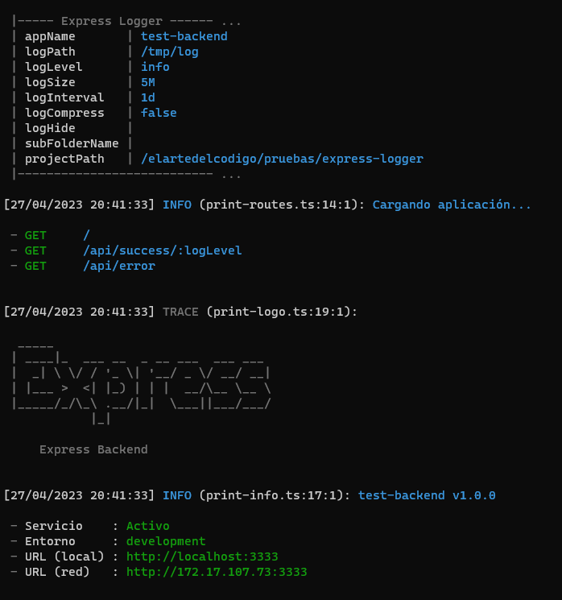

<h1 align="center">Express Logger</h1>

<p align="center">
  <a href="https://github.com/ElArteDelCodigo/express-logger/releases">
    
  </a>
  <a href="https://github.com/ElArteDelCodigo/express-logger/blob/main/LICENSE">
    
  </a>
</p>

Librería para generar logs para express con pino

## Instalación

```bash
npm install @elartedelcodigo/express-logger
```

## Ejemplo

Archivo `server.ts`

```ts
import express, { NextFunction, Request, Response } from 'express'
import { ExpressLogger, printLogo, printInfo, printRoutes } from '../../../src'
import path from 'path'
import router from './src/routes/application'

export const app = express()

ExpressLogger.initialize(app, {
  appName: 'test-backend',
  logPath: path.resolve(__dirname, './logs'),
})

const logger = ExpressLogger.getInstance()

app.use((req: Request, res: Response, next: NextFunction) => {
  logger.trace(`${req.method} ${req.originalUrl}`)
  return next()
})

// eslint-disable-next-line
app.get('/', (req: Request, res: Response, next: NextFunction) => {
  logger.info('ok')
  res.status(200).send('ok')
})

// api routes
app.use('/api', router)

// eslint-disable-next-line
app.use((err: Error, req: Request, res: Response, next: NextFunction) => {
  logger.error(err)
  res.status(500).send('error')
})

printRoutes(app)
printLogo()
printInfo({
  name: 'test-backend',
  version: '1.0.0',
  env: 'development',
  port: '3333',
})

if (require.main === module) {
  app.listen(3333, () => {
    process.stdout.write(`App running on port ${3333}\n`)
  })
}

export default app
```

Archivo `src/routes/application.ts`

```ts
import express, { NextFunction, Request, Response } from 'express'
import { ExpressLogger } from '../../../../../src'

const router = express.Router()
const logger = ExpressLogger.getInstance()

// eslint-disable-next-line
router.get('/success/:logLevel', (req: Request, res: Response, next: NextFunction) => {
  logger[req.params.logLevel](`Mensaje de tipo ${req.params.logLevel}`)
  res.status(200).send('ok')
})

// eslint-disable-next-line
router.get('/error', (req: Request, res: Response, next: NextFunction) => {
  logger.error('[local] error from src/routes/application.ts')
  throw new Error('some error')
})

export default router
```

Resultado 1: Al ejecutar la aplicación



Resultado 2: Al realizar algunas peticiones


Resultado 3:

Se habrán creado los siguientes archivos: `error.log`, `info.log` y `warn.log`.

```txt
app
  ├─ logs
  │     └─ test-backend
  │           ├─ error.log
  │           ├─ info.log
  │           └─ warn.log
  ├─ src
  │     └─ routes
  │           └─ application.ts
  └─ server.ts
```

Contenido del archivo: `info.log`

```json
{"level":30,"time":"2023-04-28T00:00:19.333Z","pid":18997,"hostname":"server","name":"test-backend","context":"print-routes.ts:14:1","msg":"Cargando aplicación..."}
{"level":30,"time":"2023-04-28T00:00:19.338Z","pid":18997,"hostname":"server","name":"test-backend","context":"print-info.ts:17:1","msg":"test-backend v1.0.0"}
{"level":30,"time":"2023-04-28T00:00:21.368Z","pid":18997,"hostname":"server","name":"test-backend","reqId":"ab168a50-e557-11ed-ba91-5504bd57ef63","context":"server.ts:22:1","msg":"ok"}
{"level":30,"time":"2023-04-28T00:00:21.372Z","pid":18997,"hostname":"server","name":"test-backend","request":{"id":"ab168a50-e557-11ed-ba91-5504bd57ef63","method":"GET","url":"/"},"response":{"statusCode":200},"response time [ms]":6,"msg":"Petición concluida - 200"}
{"level":30,"time":"2023-04-28T00:00:22.387Z","pid":18997,"hostname":"server","name":"test-backend","reqId":"abb1dff0-e557-11ed-ba91-5504bd57ef63","context":"application.ts:9:3","msg":"Mensaje de tipo info"}
...
```

## Opciones de configuración

| Opción        | Descripción                                                                    | Valor por defecto |
| ------------- | ------------------------------------------------------------------------------ | ----------------- |
| appName       | Nombre de la aplicación                                                        | 'app'             |
| logPath       | Ruta absoluta de la carpeta logs. Si esta vacio no se crearán los archvos.     | ''                |
| logLevel      | Nivel de logs a registrar. error > warn > info > debug > trace                 | 'info'            |
| logSize       | Para los ficheros de logs es el tamaño máximo que estos pueden llegar a pesar. | '5M'              |
| logInterval   | Para los ficheros de logs es el intervalo de tiempo para rotar los ficheros.   | '1d'              |
| logCompress   | Para indicar si se comprimirá o no los ficheros de logs.                       | 'false'           |
| logHide       | Indica los campos que serán ofuscados al momento de guardar los logs.          | ''                |
| subFolderName | Subcarpeta que se utilizará para guardar los ficheros de logs                  | ''                |
